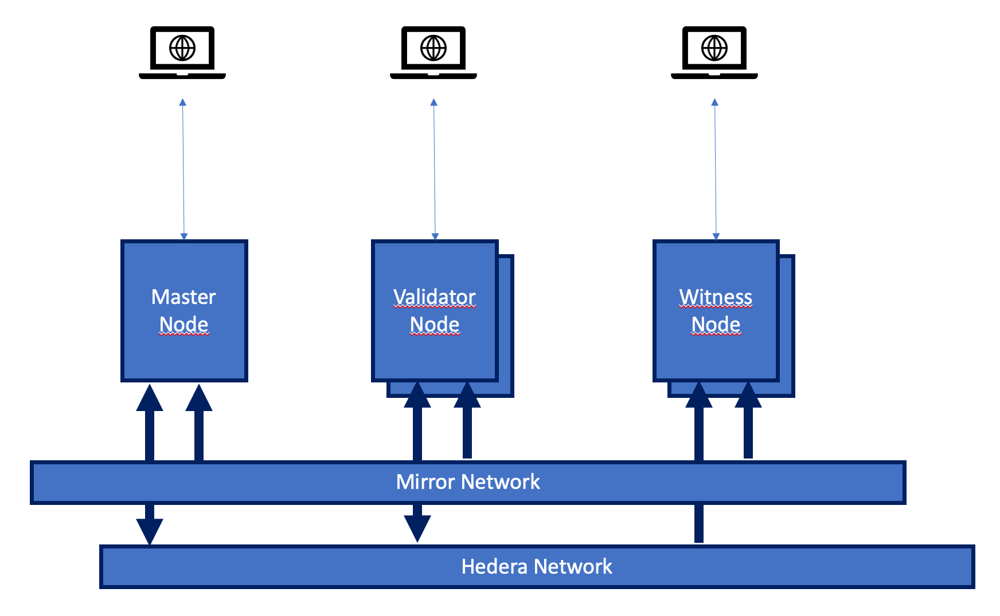
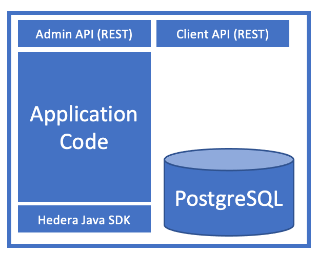
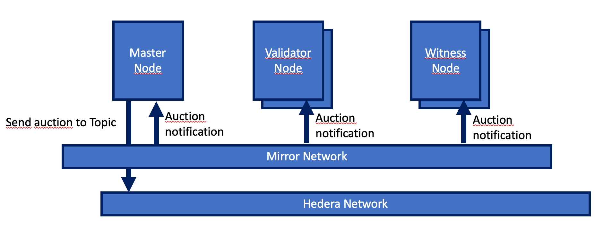

# Hedera Auction Demo Solution Specification

This document explains how the Hedera Auction Demo works at a high level, it is not intended to be a design document, rather a description of the end to end solution.

For additional detail, please refer to the JavaDocs.

## Description

The Hedera Auction demo enables Hedera Tokens to be auctioned and bids to be placed on auctioned tokens. Once the auction completes (time based), the token is transferred to the auction's winner and the winning bid is transferred to the previous owner of the token.

## Guiding principles

The solution is based on a number of guiding principles outlined below.

### Decentralization

No one person is in control of the auctions' operation and completion, indeed if the auction was run by a single operator it would be possible for that operator to stop the auction if the price isn't to their liking, take the winning bid and not transfer the token to the winner, keep all bids paid to the auction account, the operator would need to be trusted to run the auctions.

In order to achieve decentralization, the solution makes use of scheduled transactions which enable an operation (or transaction) to only be executed by Hedera if a sufficient and appropriate number of signatures is received to approve of the transaction. Thus each auction is associated to a multi-signature account which is not controlled by any single entity. Every operation on this auction account needs to be approved by another operator.

The number of keys associated with the auction account is determined when the account is created. In order to ensure that the failure of one operator to sign (e.g. being offline), a threshold lower than the total number of keys can be specified such that 7 out of 10 operators signing on a transaction is sufficient to allow it to be executed.

### Pseudo-anonymity

In order to participate and bid on an auction, it is not necessary to register or provide any personal information. The auction solution is said to be pseudonymous since the bids placed by an account can be seen on the public ledger.

### Non repudiation

Owing to the pseudo anonymity requirement above, it must not be possible for a bidder to refuse to pay the winning bid. Indeed, if bids were merely intents to pay upon winning, and the eventual winner didn't pay, it would be impossible to seek the payment from the winner, resulting in either the cancellation of the auction or an attempt to obtain payment from the next highest bid which itself could fail.

In order to ensure winning bids will be paid in full, the auction system requires that a bidder transfers the bid amount to the auction account. This transfer essentially "seals" the bid and if the bidder becomes the winner they are not able to rescind the bid.

The bidding process is therefore as follows:

_Note: all bids are paid by bidders to the auction account, all refunds are made from the auction account._

* Tom's bid is the first on an auction, if it's above reserve and above the minimum increment, the bid is accepted, Tom is the current winner. Otherwise, Tom's bid is refunded to his account.
* Tom is the current winner and Fred underbids Tom, Fred's bid is refunded to his account.
* Tom is the current winner and Fred bids higher than Tom. If the different between Fred's and Tom's bids is greater than the minimum amount, Fred becomes the current winner, Tom's earlier bid is refunded to his account, otherwise Fred's bid is refunded to his account.
* The auction has ended and Tom has managed to sneak in a last minute bid, his (now too late) bid is refunded to his account.

Also, in the event the token being auctioned has not been transferred to the auction's account, all bids are refunded since the auction has not yet started.

### Public observability

It should be possible for any member of the public to observe the auction by operating an application node themselves. This node will not actively participate in the running of the auction, but will be able to entirely verify the proper running of the auction.

## Architecture

The solution is built using a combination of Hedera Services, namely:

* Hedera Consensus Service to distribute auction details amongst participants
* Hedera Cryptocurrency Service to place bids and refund bids
* Hedera Token Service to create tokens to auction and transfer to winners
* Hedera Scheduled Transaction Service to enable multi-party signatures on transactions involving the multi-sig auction account

The solution is also defined as a layer-2 solution, meaning it uses the Hedera services above, but doesn't run on the Hedera network itself. This enables greater scalability than would otherwise be possible with on-ledger smart contracts.

In the layer-2, we find three types of application nodes:

* Validator application node: These nodes are operated by holders of one of the many keys that make up an auction account's multi-sig keys. Their role is to monitor bids on auctions and process the bids to determine if a refund is necessary, or ultimately when the auction is complete, ensure that the winning bid is transferred to the previous token owner and that the token itself is transferred to the winner. They are therefore able to sign scheduled transactions that affect the auction accounts.

* Witness application node: These nodes are monitoring nodes, they perform the same bid verification as validator nodes, but do not have the ability to issue scheduled transaction on behalf of the auction account. Rather they don't hold the necessary keys to approve such transactions. They can query the Hedera network directly (for example to check the balance of the auction account for a token is greater than 0), but do not issue transactions.

* Master application node: This particular type of node is a temporary requirement due to the fact that not all transaction types are supported by the Scheduled Transaction Service at this time. Indeed, upon "hearing" of a new auction, the auction account has to be associated with the token being auctioned. This `tokenAssociate` transaction type isn't supported by scheduled transactions yet. Furthermore, once the auction is complete, to prevent further bids being sent to the auction account, the account's `signature required` flag is enabled when the auction reaches its completion. This `accountUpdate` transaction cannot be operated via scheduled transactions either.
Once these two operations are whitelisted in the scheduled transaction service, there will be no need for these Master application nodes.

The solution also makes use of mirror nodes in order to track bids and scheduled transactions' success.

### Application node components

Each application node comprises four components.

#### Application code

This is the processing logic for the auctions, bids, refunds, etc... It is written in Java and uses the Java SDK to communicate with the Hedera Network.

#### Admin API

This is an API that enables a number of admin functions as follows, some are primarily helper functions for developers. It may be enabled or disabled through configuration.

_Note: The admin API isn't meant to be exposed to the public, there is no authorization or challenge on the API. It is meant to be invoked from the command line with a `curl` type command against a production system._

* POST Create Topic: Creates a topic and updates the `.env` file with the new topic id
* POST Create Token (convenience): Creates a new token from the specified details
* POST Create Account: Creates an auction account from the specified details (e.g. keys)
* POST Create Auction: Creates an auction from the specified details  
* POST Transfer (convenience): Transfers a token from an account to the auction account
* POST Easy Setup (convenience): Sets up an auction from scratch, creating a new topic, token, auction account, auction and transferring the token to the auction account.

#### Client API

This is an API that enables a number of client functions as follows. It may be enabled or disabled through configuration.

* GET auctions: Gets a complete list of auctions
* GET environment: Gets environment data such as network being used, name of the node operator and topic Id for use within the UI
* GET reserve not met auctions: Gets auctions that have not yet met their reserve
* GET closed auctions: Gets auctions that are closed (bids no longer accepted, token transfer to winner pending or in progress)
* GET ended auctions: Gets auctions that have ended (bids no longer accepted, token transfer to winner complete)
* GET active auctions: Gets the list of auctions that are currently accepting bids
* GET pending auctions: Gets the list of auctions that have been registered in the database and are awaiting the auctioned token to be transferred to the auction account
* GET auction by id: Gets one auction given its unique identifier
* GET Last bid by auction and account: Gets the last bid for a given account on a given auction
* GET bids for an auction: Gets the last 50 bids for a given auction
* GET generate key (convenience): Generates a public/private keypair

#### PostgreSQL database

Each node has its own local database which holds auctions and bids.

#### Browser UI

Each node may optionally serve a browser based user interface to enable anyone to view auctions and their progress.

#### Componentization

Through configuration, it's possible to run the application code and REST APIs from the same server or virtual machine. It is also possible to run the application code separate from the REST APIs to help with scalability.
In either case, the local database is shared between all the components, with the Client REST API being 100% read-only, only the application code makes updates to the database.

## Overview of the various processes

These processes are detailed later in this document in terms of their implementation at code level.

### Creation of a topic

A Hedera Consensus Service topic will need to be created in order for new auctions' details to be broadcast to all participants. This topic will be created with a `submission key` in order to prevent malicious spamming of the topic.

### Creation of a token

A token may be created by any Hedera user, typically this would be a Non Fungible Token, having a quantity of 1 and no decimals. It should also not have any compliance keys associated to it (KYC, Freeze, Admin, etc...), however these properties are not mandated by the auction system but the auction will only transfer a quantity of 1 of the token upon completion.

### Creation of an auction account

An auction account may be created through the Admin API. This account will be created with one or more public keys, resulting in a threshold key being allocated to the account. This ensures that no one party can fully control the auction account.

### Creation of an auction

An auction is defined as a unique pair made of a `Token Id` and an `Account Id` where the `Token Id` and `Account Id` are the identifiers of the token and account created above.

The same `Token Id` may not be auctioned more than once, likewise, the same `Account Id` may not be used more than once.

_Note: It may be desirable to enable the same `Token Id` to be auctioned again with a different `Account Id` pairing, assuming that all auctions for the given `Token Id` have completed. This is not supported at the time of writing._

In addition to specifying the `Token Id` and `Account Id` pair, the auction may be given additional properties:

* End Timestamp: This is the timestamp expressed in seconds since Epoch in the UTC timezone after which the auction will end. Bids placed on the auction after this time will not be accepted.
* Reserve: The reserve price for the auction expressed in `tinybars`
* Minimumbid: The minimum bid increment expressed in `tinybars`. For example, if the `minimumbid` is set to 100, the current winning bid is `200`, a bid of `250` will be rejected.
* Title: The title of the auction
* Description: The description of the auction

The administration node receiving this request will broadcast the details of the new auction on the application network's `Topic Id` such that other application nodes (validators and witnesses) can add the auction to their own database and start processing or verifying bids on the auction. The auction's status will be "PENDING".

The master node will associate the auction account with the token being auctioned on behalf of the application network (this operation cannot currently be performed by way of scheduled transactions).

If any bids are received (hbar transferred to the auction account), they will be automatically refunded until the status of the auction is "OPEN". Whether a bid was received too early is determined by comparing the consensus timestamp of the bid transaction with the consensus timestamp of the transfer of the token to the auction account. If the bid timestamp is earlier than the transfer, it is considered too early and is refunded.

### Transfer of the auctioned token to the auction account

The auction will not start until nodes have detected that the current owner of the token has transferred it to the auction account. This is to ensure that when the auction has ended, the owner cannot refuse to transfer the token to the auction's winner.
The system will refund all bids prior to the consensus timestamp of this token transfer transaction.

### Auction starts

Once the token has transferred to the auction account, the status of the auction is deemed to be "ACTIVE" and is able to receive bids.

### Receiving bids

All nodes periodically query a mirror node for `cryptotransfer` transactions to any of the auctions registered in the database. If such a transfer is detected the application code determines if the bid is valid (above reserve, greater than minimum increment, etc...).

If the bid is valid and greater than the current winning bid, the current winning bid is refunded to the bidding account, the new bid is accepted as the new current winner.

If the bid is valid and lower than the current winning bid, it is refunded to the bidding account.

Note: All bids are processed strictly in order of consensus timestamp, if two equal and potentially winning bids arrive one after the other, the first will be considered the new winning bid, the second will be refunded.

Refunds are processed as `cryptotransfer` transactions which are issued as scheduled transactions, each node will attempt to create a scheduled transaction and in the event it already exists will add its signature to the transaction. Once Hedera determines a sufficient number of valid signatures have been received, the transfer will be performed.

### Closing the auction

All nodes periodically query a mirror node for the last known transaction of any type, if the consensus timestamp of the last transaction is greater than the auction's end timestamp, the status of the auction changes to "CLOSED".

The master node will update the auction account's `receiver signature` flag to `true` to prevent any further bids from being sent to the auction account.

Nodes will continue to watch for bids after the auction has closed just in case a bidder managed to submit a bid after the auction's end timestamp, but before the flag above was enabled. This is to ensure no bids are left stranded after the auction closed.

Once the auction is closed, all nodes will monitor the winning account, looking for a balance of 0 for the account + token pair, this indicates the winner has associated with the token.

When this association is detected, all nodes will submit a `cryptotransfer` scheduled transaction which will transfer the token from the auction account to the winner and the winning bid from the auction account to the previous token owner.

In the event the auction ends without bids, or all bid were below reserve, a `cryptotransfer` scheduled transaction will return the token to its original owner.

### Ending the auction

Once the nodes are satisfied the atomic transfer of the token + hbar to the winner and original token owner has completed, the auction status changes to "ENDED".
